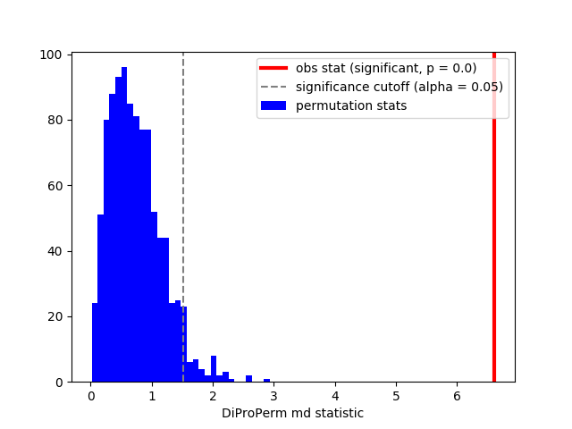

DiProPerm
----

**author**: `Iain Carmichael`_

Additional documentation, examples and code revisions are coming soon.
For questions, issues or feature requests please reach out to Iain:
iain@unc.edu.

Overview
========

Direction-Projection-Permutation for High Dimensional
Hypothesis Tests https://arxiv.org/pdf/1304.0796.pdf

Installation
============
This is currently an informal package under development so I've only made it installable from github.

::

    git clone https://github.com/idc9/diproperm.git
    python setup.py install

Example
=======

.. code:: python

    from sklearn.datasets import make_blobs
    import numpy as np
    import matplotlib.pyplot as plt
    # %matplotlib inline

    from diproperm.DiProPerm import DiProPerm

    X, y = make_blobs(n_samples=100, n_features=2, centers=2, cluster_std=2)

    dpp = DiProPerm(B=1000, stat='md')
    dpp.fit(X, y)

    dpp.results['md']
    {'Z': 11.704865481794599,
     'cutoff_val': 1.2678333596648679,
     'obs': 4.542253375623943,
     'pval': 0.0,
     'rejected': True}

    dpp.hist('md')

For some more example code see `these example notebooks`_.

Help and Support
================

Additional documentation, examples and code revisions are coming soon.
For questions, issues or feature requests please reach out to Iain:
iain@unc.edu.

Documentation
^^^^^^^^^^^^^

The source code is located on github: https://github.com/idc9/diproperm.

Testing
^^^^^^^

Testing is done using `nose`.

Contributing
^^^^^^^^^^^^

We welcome contributions to make this a stronger package: data examples,
bug fixes, spelling errors, new features, etc.

.. _Iain Carmichael: https://idc9.github.io/
.. _these example notebooks: https://github.com/idc9/diproperm/tree/master/doc
